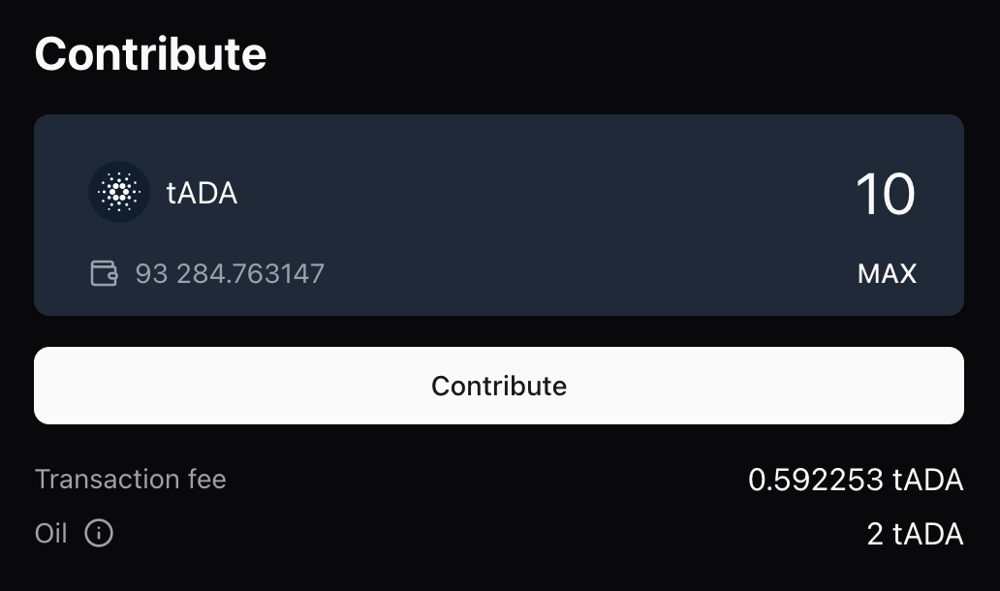
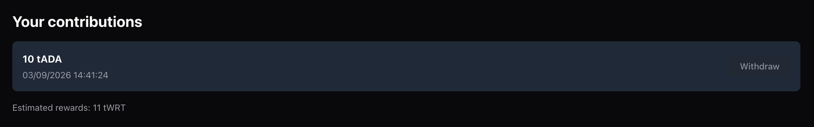
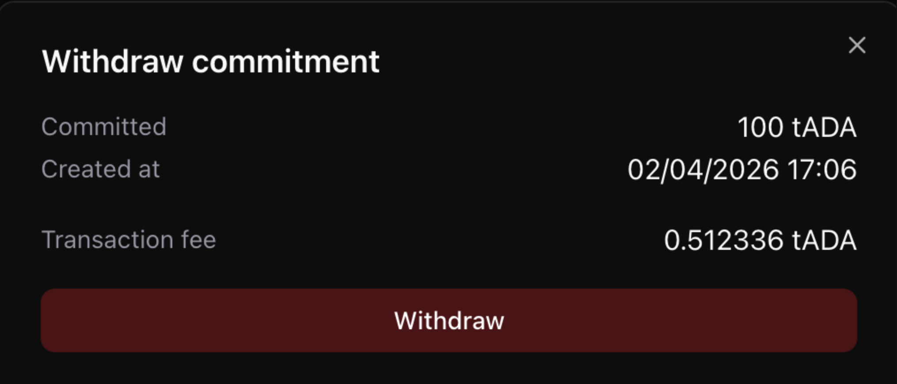

# Contribute to a token launch

## Prerequisites

- Cardano wallet (Eternl, NuFi, Lace or Typhon)
- At least 1 ADA to cover the transaction fee
- Funds to cover your contribution

## Create a contribution

To create a new contribution to the selected launch, enter the amount you would like to contribute and click the `Contribute` button. Then sign the transaction in your wallet.

Your contribution will appear in the list of your contributions below.

## Withdraw a contribution

To withdraw a contribution, click the `Withdraw` button for the contribution you want to withdraw. Review the details and sign the transaction in your wallet.

