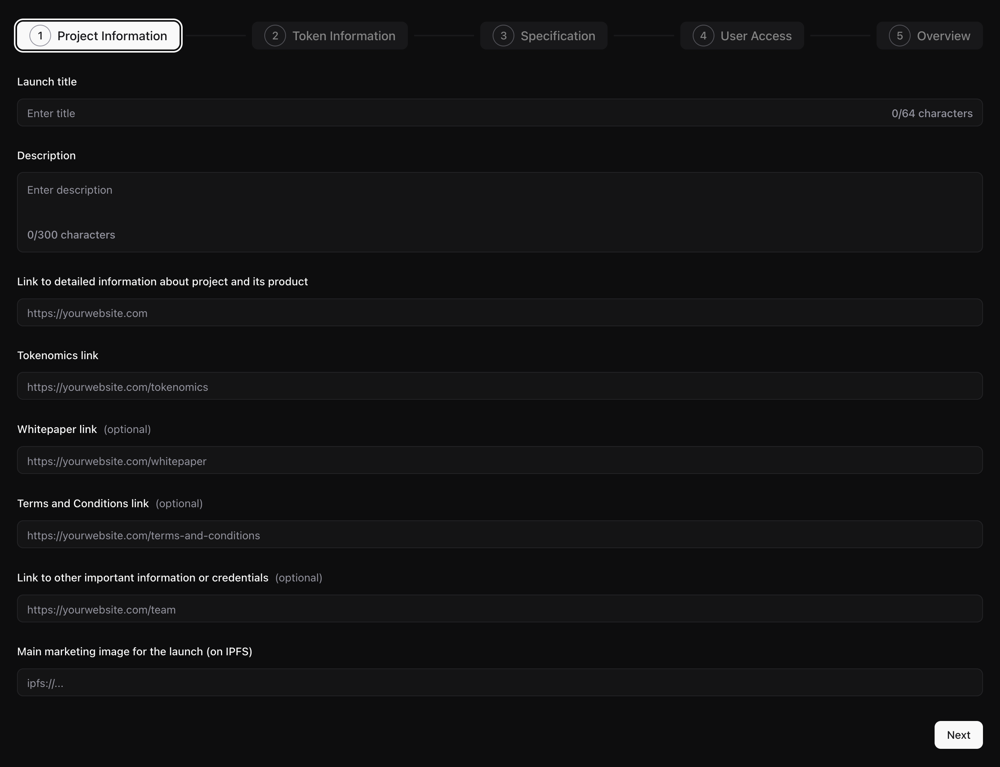
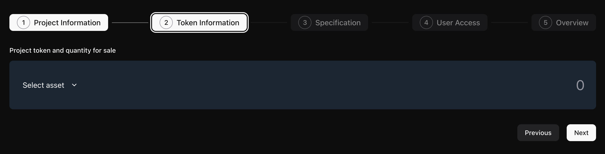
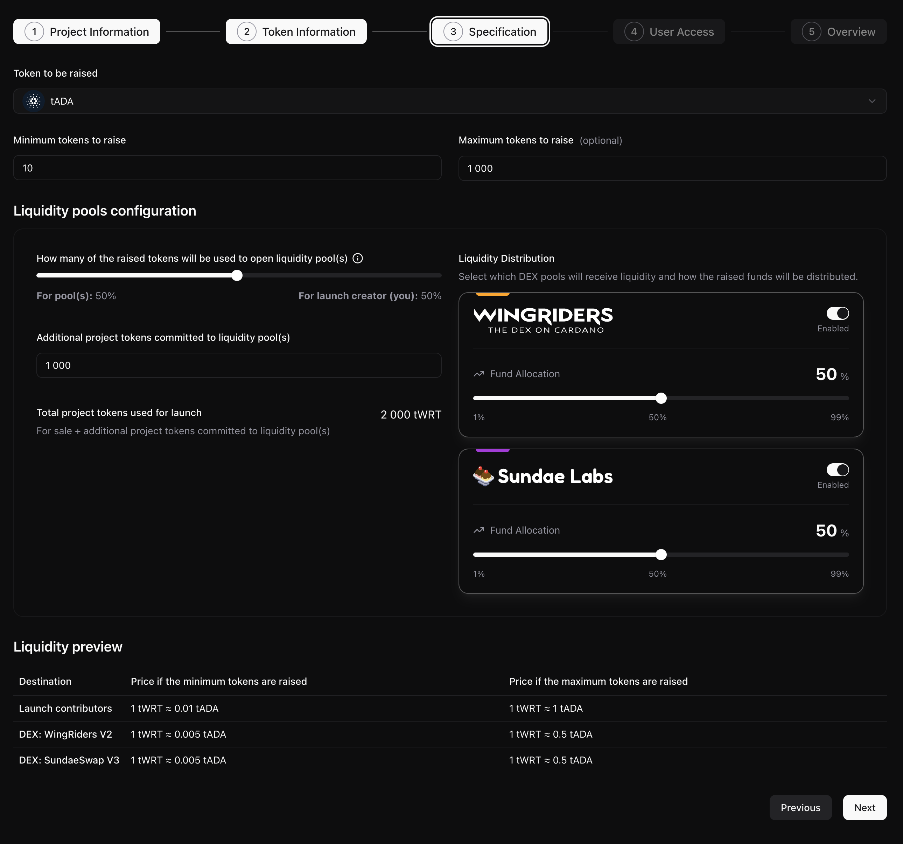
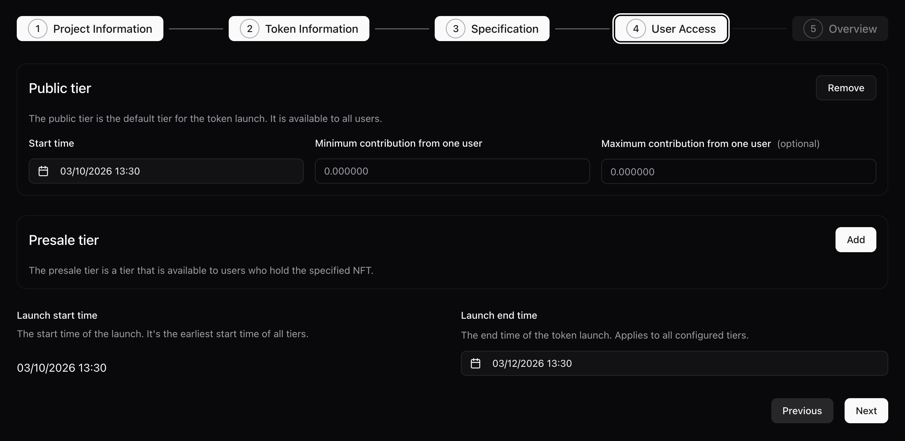
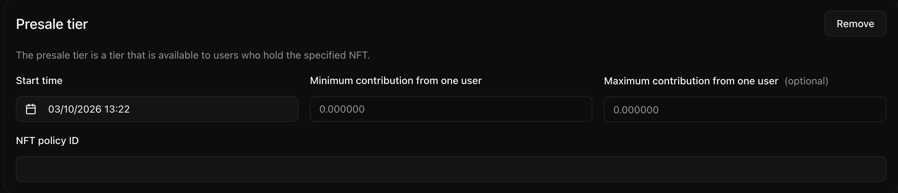
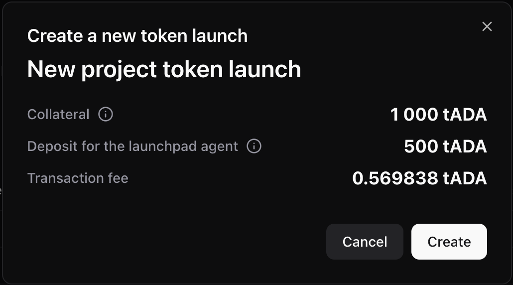

# Create a new token launch

## Prerequisites

- Cardano wallet (Eternl, NuFi, Lace or Typhon)
- Minted project token in your wallet
- At least 1501 ADA (1000 ADA for a refundable collateral, 500 ADA for deploying refundable launch-specific smart contracts and 1 ADA for the transaction fee)

## 1. Project information

Enter the basic details and links that describe your project and will be shown to participants.

| Field                                                          | Description                                                                         |
| -------------------------------------------------------------- | ----------------------------------------------------------------------------------- |
| **Launch title**                                               | A short name for your token launch (required, up to 64 characters).                 |
| **Description**                                                | A description of the project and the launch (required, up to 300 characters).       |
| **Link to detailed information about project and its product** | Main project website or info page (required, must start with `https://`).           |
| **Tokenomics link**                                            | URL to your tokenomics document or page (required, must start with `https://`).     |
| **Whitepaper link**                                            | URL to your whitepaper (optional, must start with `https://`).                      |
| **Terms and Conditions link**                                  | URL to terms and conditions (optional, must start with `https://`).                 |
| **Link to other important information or credentials**         | URL to team, audits, or other materials (optional, must start with `https://`).     |
| **Main marketing image for the launch (on IPFS)**              | IPFS URL for the launch logo or banner image (required, must start with `ipfs://`). |

## 2. Token information

Choose which project token to sell and how much of it will be distributed to launch participants.

| Field                                   | Description                                                                                                                           |
| --------------------------------------- | ------------------------------------------------------------------------------------------------------------------------------------- |
| **Project token and quantity for sale** | Select a token from your wallet and enter the amount you want to offer in the launch. The quantity cannot exceed your wallet balance. |

## 3. Specification

Set the fundraising target, the token you want to raise (e.g. ADA), and how liquidity will be split between pools.

| Field                                                                    | Description                                                                                                                                                 |
| ------------------------------------------------------------------------ | ----------------------------------------------------------------------------------------------------------------------------------------------------------- |
| **Token to be raised**                                                   | The token that participants will pay (e.g. ADA, iUSD, or Djed).                                                                                             |
| **Minimum tokens to raise**                                              | The minimum amount that must be raised for the launch to succeed (in the selected token).                                                                   |
| **Maximum tokens to raise**                                              | Optional cap on how much can be raised; leave empty for no maximum.                                                                                         |
| **How many of the raised tokens will be used to open liquidity pool(s)** | Slider (1–100%): share of raised funds that goes into the liquidity pool(s) vs. the share you keep. As creator, you receive the pool share tokens (vested). |
| **Additional project tokens committed to liquidity pool(s)**             | Extra project tokens (in addition to those for sale) that will be added to the liquidity pool(s).                                                           |
| **Liquidity Distribution**                                               | Choose which DEX pools (WingRiders, Sundae) receive liquidity and the allocation percentage between them. You can enable one or both and adjust the split.  |

## 4. User access

Define who can participate and when: add a public tier, a presale tier (NFT-gated), or both, and set the launch end time.

**Presale tier configuration** (when the presale tier is added):

| Field                                                 | Description                                                                                   |
| ----------------------------------------------------- | --------------------------------------------------------------------------------------------- |
| **Public tier**                                       | Optional. The default tier for everyone. Click **Add** to enable it.                          |
| **Public tier – Start time**                          | When the public tier opens for participation.                                                 |
| **Public tier – Minimum contribution from one user**  | Minimum amount (in the raised token) a user must contribute in this tier.                     |
| **Public tier – Maximum contribution from one user**  | Optional maximum contribution per user in this tier.                                          |
| **Presale tier**                                      | Optional. Tier only for holders of a specific NFT. Click **Add** to enable it.                |
| **Presale tier – Start time**                         | When the presale tier opens.                                                                  |
| **Presale tier – Minimum contribution from one user** | Minimum contribution in the presale tier.                                                     |
| **Presale tier – Maximum contribution from one user** | Optional maximum contribution per user in the presale tier.                                   |
| **Presale tier – NFT policy ID**                      | The Cardano policy ID of the NFT that grants access to the presale (56-character hex string). |
| **Launch start time**                                 | Read-only; shows the earliest start time among all tiers.                                     |
| **Launch end time**                                   | When the token launch ends for all tiers. Must be after every tier’s start time.              |

You must add at least one tier (public or presale).

## 5. Confirm and submit transaction

Review the summary and sign the transaction to create the launch on-chain.

| Item                                | Description                                                                                   |
| ----------------------------------- | --------------------------------------------------------------------------------------------- |
| **Collateral**                      | Refundable deposit (1000 ADA) required to create the launch; returned if the launch succeeds. |
| **Deposit for the launchpad agent** | Deposit used to deploy smart contracts; partially returned after the launch ends.             |
| **Transaction fee**                 | Network fee for submitting the transaction.                                                   |

Click **Create** to sign with your wallet and submit. After a successful submission you are redirected to the launch page.
